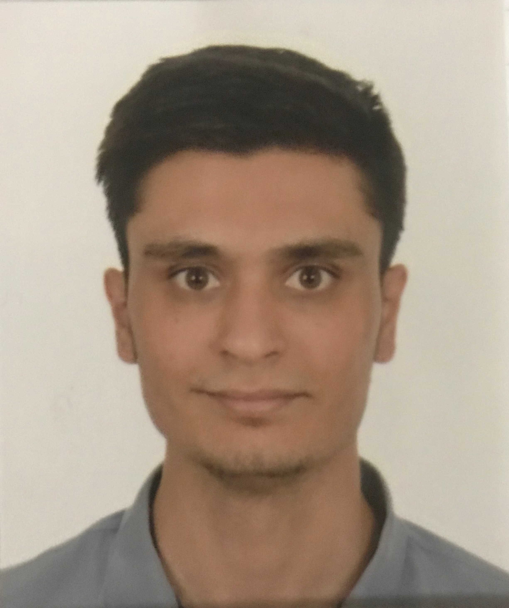

Aside
================================================================================

{width=80%}

Contact {#contact}
--------------------------------------------------------------------------------

- <i class="fa fa-envelope"></i> erolmustafa541@gmail.com
- <i class="fa fa-github"></i> [https://github.com/erolmustafa](https://github.com/erolmustafa)
<i class="fa fa-link"></i> https://mustafaerol.netlify.com
- <i class="fa fa-phone"></i> +90 530 0704850
- For more information, please contact me via email.

Skills {#skills}
--------------------------------------------------------------------------------

Eager to learn in

- Financial Analysis, Audit
- Marketing
- Data Science, Statistical Analysis
- Web Design

Basic knowledge in

- R
- Stata, Panel Data Analysis
- MS Office
- Brackets

Disclaimer {#disclaimer}
--------------------------------------------------------------------------------

Main
================================================================================

Mustafa EROL {#title}
--------------------------------------------------------------------------------

### Currently looking for new opportunities to maximize potential while providing freedom, creativity and lifestyle

Education {data-icon=graduation-cap data-concise=true}
--------------------------------------------------------------------------------

### Pamukkale University

Bachelor's Degree in Economics(English)

Denizli, Turkey

2013 - 2015

I studied in one-year preparatory class and after second year I moved to Yildiz Technical University through undergraduate transfer.

### Yildiz Technical University

Bachelor's Degree in Economics(English)

Istanbul, Turkey

2015 - 2019 January

Thesis: Kuznets Hypothesis and the Effects of Basic Public Policies

GPA: 3.23/4

Projects and Achievements{data-icon=laptop}
--------------------------------------------------------------------------------

### Financial Statement Analysis Course Project

Coca-Cola Icecek A.S.

Istanbul, Turkey

2017

https://www.academia.edu/38268831/Coca-Cola_Icecek.pdf

### Undergraduate Thesis

Kuznets Hypothesis and the Effects of Basic Public Policies

Istanbul, Turkey

2018

https://www.academia.edu/38195599/Undergraduate_Thesis.pdf

### PwC Case Challenge Finalist

PwC Turkey

Istanbul, Turkey

2019

At final stage we are one of the 10 groups as a group with my two friends
  

Professional Experience {data-icon=suitcase}
--------------------------------------------------------------------------------

### Intern (Two Months)

IETT, Strategy Planning Department

Istanbul, Turkey

2018 June

::: concise
- Helped organizing the workshop at Ikitelli Garage. 
- Prepared the presentation of supplier satisfaction survey for 2017.
- Bus operators had made their presentation in Paris at IBBG meeting. i translated them to Turkish and then reported. 
- For an award I translated required information to Turkish from the website such as the guidelines for application.
:::

Affiliations {data-icon=users}
--------------------------------------------------------------------------------

### YTU Business, YTU Economics, IASTE YTU

